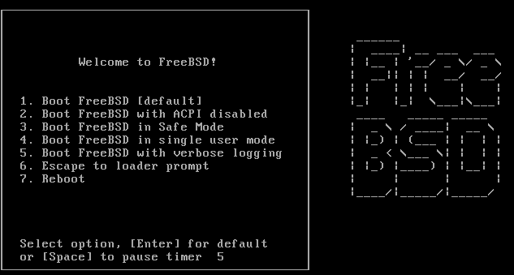
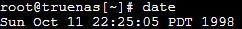
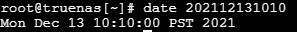

**Ajustando Data e hora em Sistemas baseados em FreeBSD.**

Bom dia, pessoal.

Para quem trabalha com T.I., sabemos que a sincronização precisa de tempo é essencial para manter as conexões estáveis entre servidores e hosts. Em sistemas baseados em BSD, como o TrueNAS e o pfSense, isso não é diferente. A precisão na configuração do tempo é fundamental para garantir o bom funcionamento da rede e dos serviços.

No seu Shell logado como root.

Para visualizar a data e hora atual, rode o comando date

Assim o sistema irá exibir  a atual data e hora.

Para corrigir, simplesmente vamos por o comando date seguido pela data e hora.

AnoMêsDiaHoraMinutos

# date ccyymmddHHMM

Data e Hora atualizada. =)

**Sincronizar a hora com um servidor NTP.**

É recomendado utilizar o NTP (Network Time Protocol) para manter a hora correta automaticamente. Você pode sincronizar a data e hora com um servidor NTP assim:

ntpdate endereço_do_servidor_ntp

ntpdate pool.ntp.org

O sistema irá sincronizar a hora com um servidor NTP.

**Fixando servidor NTP Manualmente:**

navegue até /etc e edite o arquivo rc.conf =  */etc/rc.conf*

Adicione:

*ntpd_enable="YES"*

**Inicie o serviço:**

*service ntpd start*

**Salvando as configurações no hardware clock do appliance:**

Isso garante que o relógio do appliance esteja sincronizado com o sistema operacional.

*hwclock --systohc*

